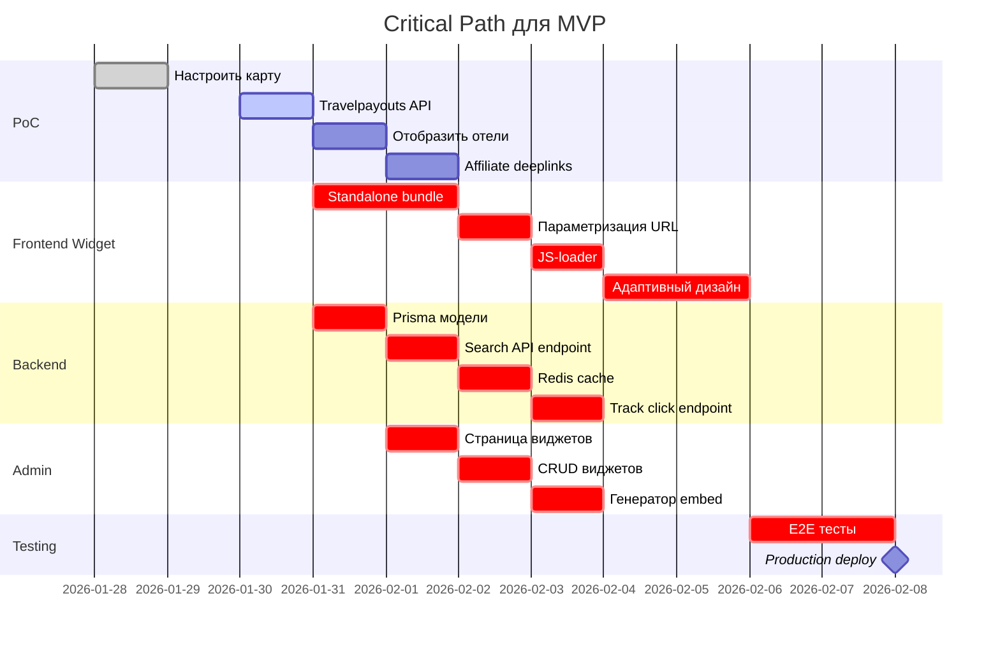

# 🗺️ Roadmap: Встраиваемый модуль интерактивной карты размещения

> **Проект**: Affiliate Widget для монетизации через размещение (аналог stay22.com)  
> **Интеграция**: В рамках Your Ski Concierge  
> **Статус**: Планирование  
> **Дата**: 28 января 2026

---

## 📋 Оглавление

1. [Обзор продукта](#обзор-продукта)
2. [Этапы разработки](#этапы-разработки)
3. [Архитектура решения](#архитектура-решения)
4. [Roadmap по этапам](#roadmap-по-этапам)
5. [Critical Path](#critical-path)
6. [Риски и узкие места](#риски-и-узкие-места)
7. [AI-автоматизация](#ai-автоматизация)
8. [Структура репозитория](#структура-репозитория)
9. [GitHub Issues](#github-issues)

---

## 🎯 Обзор продукта

### Целевая аудитория
- Сайты горнолыжных курортов
- Страницы событий
- Тревел-блогеры
- Локальные туристические порталы

### Ключевая ценность
Владельцы сайтов встраивают карту через iframe/JS → посетители бронируют жилье → владелец получает affiliate комиссию

### Способы интеграции
```html
<!-- Вариант 1: iframe -->
<iframe src="https://ski-concierge.com/map-widget?lat=43.6&lng=40.3&type=resort" 
        width="100%" height="600"></iframe>

<!-- Вариант 2: JS Script -->
<div id="ski-map-widget"></div>
<script src="https://ski-concierge.com/widget.js" 
        data-lat="43.6" 
        data-lng="40.3" 
        data-type="resort"
        data-partner-id="YOUR_ID"></script>
```

### OTA партнёры

#### MVP: Travelpayouts (Партнёрская сеть)
- **Travelpayouts** (travelpayouts.com) - крупнейшая партнёрская сеть для туризма
  - Агрегирует: Booking.com, Hotellook, Aviasales и 100+ OTA
  - Единый API для всех источников
  - Готовые affiliate deeplinks
  - **API Token**: `3286214c096eaaaee7af14894a3f9586`

#### v1: Прямые интеграции (РФ)
- **Островок** (ostrovok.ru) - крупнейший российский агрегатор
- **Суточно.ру** (sutochno.ru) - аренда квартир и апартаментов
- **101Hotels** - российская сеть бронирования
- **Яндекс Путешествия** - для расширения покрытия

---

## 🏗️ Этапы разработки

### 📊 Временная шкала

| Этап | Длительность | Результат |
|------|--------------|-----------|
| **PoC** | 3-5 дней | Работающий прототип с картой и 1 источником данных |
| **MVP** | 15-20 дней | Готовый к запуску виджет с админкой и affiliate |
| **v1** | 20-30 дней | Полнофункциональный продукт с AI и аналитикой |

---

## 🏗️ Архитектура решения

```
┌─────────────────────────────────────────────────────────────┐
│                    PARTNER SITES                             │
│  (Курорты, блоги, события)                                  │
└────────────────┬────────────────────────────────────────────┘
                 │
                 ├─── iframe embed
                 └─── JS script embed
                          │
                          ▼
┌─────────────────────────────────────────────────────────────┐
│              FRONTEND WIDGET (React Bundle)                  │
│  ┌──────────┐  ┌──────────┐  ┌──────────────┐              │
│  │   Map    │  │  Filters │  │  Hotel Cards │              │
│  │ (Leaflet)│  │  UI      │  │  + Prices    │              │
│  └──────────┘  └──────────┘  └──────────────┘              │
└────────────────┬────────────────────────────────────────────┘
                 │ REST API
                 ▼
┌─────────────────────────────────────────────────────────────┐
│                  BACKEND (Fastify)                           │
│  ┌────────────────┐  ┌────────────────┐  ┌───────────────┐ │
│  │ Accommodation  │  │   Affiliate    │  │   Analytics   │ │
│  │    Search      │  │   Tracking     │  │   Logging     │ │
│  │    API         │  │   Deeplinks    │  │   CTR, etc    │ │
│  └────────────────┘  └────────────────┘  └───────────────┘ │
└────────────────┬────────────────────────────────────────────┘
                 │
      ┌──────────┴──────────┬──────────────┐
      ▼                     ▼              ▼
┌──────────┐        ┌──────────┐    ┌──────────┐
│PostgreSQL│        │  Redis   │    │   OTA    │
│  (Data)  │        │ (Cache)  │    │   APIs   │
│          │        │          │    │(Островок,│
│- Widgets │        │- Search  │    │Суточно.ру│
│- Partners│        │  results │    │101Hotels)│
│- Clicks  │        │- Rate    │    │          │
└──────────┘        │  limit   │    └──────────┘
                    └──────────┘
                          │
                          ▼
                  ┌──────────────┐
                  │ ADMIN PANEL  │
                  │  (Refine)    │
                  │              │
                  │- Widgets mgmt│
                  │- Analytics   │
                  │- Partners    │
                  └──────────────┘
```

### Технологический стек

#### Frontend Widget
- **Framework**: React 18 + TypeScript
- **Map**: Leaflet.js (легковесная, OSM)
- **Bundle**: Vite (standalone build)
- **UI**: shadcn/ui (переиспользование из проекта)
- **State**: Zustand (легче Redux)

#### Backend
- **Runtime**: Node.js 20+
- **Framework**: Fastify (уже используется)
- **Database**: PostgreSQL 14+ (существующая)
- **Cache**: Redis 7+ (новое)
- **ORM**: Prisma (уже используется)

#### Admin Panel
- **Framework**: Refine (уже используется)
- **UI**: Ant Design (существующий стек)

---

## 📅 Roadmap по этапам

## 🔬 Этап 1: PoC (Proof of Concept)

**Цель**: Проверить техническую осуществимость  
**Длительность**: 3-5 дней  
**Результат**: Рабочий прототип с картой и реальными данными

### Задачи

| # | Задача | Время | Приоритет | Зависимости |
|---|--------|-------|-----------|-------------|
| 1.1 | Настроить Leaflet карту на отдельной странице `/map` | 4ч | 🔴 Critical | - |
| 1.2 | Реализовать компонент поиска по координатам | 3ч | 🔴 Critical | 1.1 |
| 1.3 | Интеграция с Travelpayouts API (token готов) | 4ч | 🔴 Critical | - |
| 1.4 | Отображение 5-10 отелей на карте (маркеры) | 4ч | 🔴 Critical | 1.2, 1.3 |
| 1.5 | Карточка отеля (popup) с ценой и кнопкой "Забронировать" | 3ч | 🟡 High | 1.4 |
| 1.6 | Генерация affiliate deeplink для Travelpayouts | 1ч | 🔴 Critical | 1.3 |
| 1.7 | Базовое логирование кликов в console | 1ч | 🟢 Medium | 1.6 |

**Итого**: 23 часа ≈ **3-4 рабочих дня**

### Чек-лист готовности PoC
- [ ] Карта отображается на странице `/map`
- [ ] Можно задать координаты курорта (например, Роза Хутор: 43.66, 40.31)
- [ ] Показываются реальные отели из Travelpayouts API (Hotellook)
- [ ] Клик по "Забронировать" ведет на Hotellook с нашим marker ID
- [ ] API token работает и возвращает данные
- [ ] В консоли видны логи кликов

---

## 🚀 Этап 2: MVP (Minimum Viable Product)

**Цель**: Готовый к production виджет с минимальным функционалом  
**Длительность**: 15-20 дней  
**Результат**: Партнеры могут встраивать виджет и получать комиссию

### 2.1 Frontend Widget (7-9 дней)

| # | Задача | Время | Приоритет | Зависимости |
|---|--------|-------|-----------|-------------|
| 2.1.1 | Создать standalone React bundle для iframe | 6ч | 🔴 Critical | PoC |
| 2.1.2 | Параметризация через URL (lat, lng, radius, type) | 4ч | 🔴 Critical | 2.1.1 |
| 2.1.3 | Создать JS-loader скрипт для встраивания | 5ч | 🔴 Critical | 2.1.1 |
| 2.1.4 | Фильтры: цена (мин/макс), рейтинг | 6ч | 🟡 High | PoC |
| 2.1.5 | Сортировка: по цене, расстоянию, рейтингу | 4ч | 🟡 High | 2.1.4 |
| 2.1.6 | Адаптивный дизайн (mobile + desktop) | 8ч | 🔴 Critical | 2.1.1 |
| 2.1.7 | Загрузчики (skeleton) для карточек | 3ч | 🟢 Medium | - |
| 2.1.8 | Обработка ошибок API (fallback UI) | 4ч | 🟡 High | 2.1.1 |
| 2.1.9 | Lazy loading при скролле карты | 5ч | 🟢 Medium | PoC |
| 2.1.10 | Мультиязычность (RU/EN) | 6ч | 🟢 Medium | - |

**Итого**: 51 час ≈ **7-9 дней**

### 2.2 Backend API (5-6 дней)

| # | Задача | Время | Приоритет | Зависимости |
|---|--------|-------|-----------|-------------|
| 2.2.1 | Создать Prisma модели: Widget, Partner, Click | 3ч | 🔴 Critical | - |
| 2.2.2 | API endpoint: `POST /api/accommodation/search` | 4ч | 🔴 Critical | 2.2.1 |
| 2.2.3 | Оптимизация Travelpayouts API запросов | 4ч | 🟡 High | PoC |
| 2.2.4 | Кеширование Travelpayouts результатов | 4ч | 🟡 High | 2.2.3 |
| 2.2.5 | Нормализация данных (единый формат) | 5ч | 🔴 Critical | 2.2.3, 2.2.4 |
| 2.2.6 | Настроить Redis для кэширования поисков | 4ч | 🔴 Critical | - |
| 2.2.7 | TTL cache = 1 час для поисковых запросов | 2ч | 🟡 High | 2.2.6 |
| 2.2.8 | Rate limiting (100 req/min на IP) | 3ч | 🔴 Critical | - |
| 2.2.9 | API endpoint: `POST /api/affiliate/track-click` | 4ч | 🔴 Critical | 2.2.1 |
| 2.2.10 | Генератор deeplinks с подстановкой partner_id | 3ч | 🔴 Critical | 2.2.9 |

**Итого**: 42 часа ≈ **5-6 дней**

### 2.3 Admin Dashboard (3-4 дня)

| # | Задача | Время | Приоритет | Зависимости |
|---|--------|-------|-----------|-------------|
| 2.3.1 | Страница в админке: `/widgets` | 2ч | 🔴 Critical | 2.2.1 |
| 2.3.2 | CRUD для виджетов (создать, список, удалить) | 6ч | 🔴 Critical | 2.3.1 |
| 2.3.3 | Генератор embed кода (iframe + JS) | 4ч | 🔴 Critical | 2.3.2 |
| 2.3.4 | Preview виджета в админке | 5ч | 🟡 High | 2.3.2 |
| 2.3.5 | Управление партнерами (CRUD) | 5ч | 🔴 Critical | 2.2.1 |
| 2.3.6 | Страница аналитики: таблица кликов | 6ч | 🟡 High | 2.2.9 |
| 2.3.7 | Метрики: всего кликов, CTR, по виджетам | 4ч | 🟡 High | 2.3.6 |

**Итого**: 32 часа ≈ **3-4 дня**

### 2.4 Интеграция и тестирование (2-3 дня)

| # | Задача | Время | Приоритет | Зависимости |
|---|--------|-------|-----------|-------------|
| 2.4.1 | E2E тестирование виджета на тестовом сайте | 6ч | 🔴 Critical | Все выше |
| 2.4.2 | Unit тесты для API endpoints | 8ч | 🟡 High | 2.2.* |
| 2.4.3 | Проверка корректности affiliate ссылок | 3ч | 🔴 Critical | 2.2.10 |
| 2.4.4 | Stress testing: 1000 одновременных запросов | 4ч | 🟢 Medium | 2.2.* |
| 2.4.5 | Настроить логирование ошибок (Sentry) | 3ч | 🟡 High | - |

**Итого**: 24 часа ≈ **2-3 дня**

### Чек-лист готовности MVP
- [ ] Виджет встраивается на любой сайт через iframe/JS
- [ ] Работает поиск жилья через Travelpayouts (агрегация 100+ OTA)
- [ ] Все клики логируются в БД
- [ ] Affiliate deeplinks генерируются правильно
- [ ] В админке видна статистика кликов
- [ ] Партнер может создать свой виджет и получить embed код
- [ ] Виджет работает на mobile и desktop
- [ ] Настроен cache и rate limiting
- [ ] Логирование ошибок в Sentry

**ИТОГО MVP**: 149 часов ≈ **15-20 рабочих дней**

---

## ⭐ Этап 3: v1 (Production Ready + AI)

**Цель**: Полнофункциональный продукт с AI-оптимизацией  
**Длительность**: 20-30 дней  
**Результат**: Конкурентный продукт, готовый к масштабированию

### 3.1 AI-компоненты (8-10 дней)

| # | Задача | Время | Приоритет | Зависимости |
|---|--------|-------|-----------|-------------|
| 3.1.1 | Модель ранжирования отелей (click prediction) | 12ч | 🟡 High | MVP |
| 3.1.2 | Сбор training data: клики, конверсии | 6ч | 🟡 High | MVP |
| 3.1.3 | Feature engineering: цена, расстояние, рейтинг, время | 8ч | 🟡 High | 3.1.2 |
| 3.1.4 | Обучение LightGBM модели на исторических данных | 10ч | 🟡 High | 3.1.3 |
| 3.1.5 | Inference API для ранжирования в реальном времени | 8ч | 🟡 High | 3.1.4 |
| 3.1.6 | A/B тестирование: контрольная vs AI-ранжирование | 12ч | 🟢 Medium | 3.1.5 |
| 3.1.7 | Dashboard A/B тестов в админке | 6ч | 🟢 Medium | 3.1.6 |
| 3.1.8 | Автоматическая оптимизация фильтров (популярные пресеты) | 8ч | 🟢 Medium | 3.1.2 |

**Итого**: 70 часов ≈ **8-10 дней**

### 3.2 Расширенная аналитика (4-5 дней)

| # | Задача | Время | Приоритет | Зависимости |
|---|--------|-------|-----------|-------------|
| 3.2.1 | Postback интеграция (Островок/Суточно.ru конверсии) | 10ч | 🟡 High | MVP |
| 3.2.2 | Визуализация воронки: показы → клики → бронирования | 6ч | 🟡 High | 3.2.1 |
| 3.2.3 | Когортный анализ партнеров | 5ч | 🟢 Medium | MVP |
| 3.2.4 | Экспорт отчетов в CSV/Excel | 4ч | 🟢 Medium | 3.2.2 |
| 3.2.5 | Real-time dashboard с WebSocket | 8ч | 🟢 Medium | MVP |
| 3.2.6 | Email-отчеты для партнеров (еженедельно) | 5ч | 🟢 Medium | 3.2.2 |

**Итого**: 38 часов ≈ **4-5 дней**

### 3.3 Дополнительные OTA интеграции (3-4 дня)

| # | Задача | Время | Приоритет | Зависимости |
|---|--------|-------|-----------|-------------|
| 3.3.1 | Интеграция 101Hotels API | 8ч | 🟢 Medium | MVP |
| 3.3.2 | Интеграция Яндекс Путешествия API | 10ч | 🟢 Medium | MVP |
| 3.3.3 | Единый формат для всех источников | 4ч | 🟡 High | 3.3.1, 3.3.2 |
| 3.3.4 | Настройка приоритетов источников в админке | 5ч | 🟢 Medium | 3.3.3 |

**Итого**: 27 часов ≈ **3-4 дня**

### 3.4 Продвинутые фичи виджета (5-6 дней)

| # | Задача | Время | Приоритет | Зависимости |
|---|--------|-------|-----------|-------------|
| 3.4.1 | Темизация виджета (светлая/темная тема) | 6ч | 🟢 Medium | MVP |
| 3.4.2 | Кастомизация цветов через параметры | 5ч | 🟢 Medium | 3.4.1 |
| 3.4.3 | Показ погоды для курорта (OpenWeather API) | 6ч | 🟢 Medium | MVP |
| 3.4.4 | Сравнение нескольких отелей (comparison table) | 8ч | 🟢 Medium | MVP |
| 3.4.5 | "Сохранить в избранное" (localStorage) | 4ч | 🟢 Medium | MVP |
| 3.4.6 | Социальные кнопки "Поделиться" | 3ч | 🟢 Medium | MVP |
| 3.4.7 | Показ скидок и спецпредложений (badges) | 5ч | 🟡 High | MVP |

**Итого**: 37 часов ≈ **5-6 дней**

### 3.5 DevOps и масштабирование (4-5 дней)

| # | Задача | Время | Приоритет | Зависимости |
|---|--------|-------|-----------|-------------|
| 3.5.1 | CDN для статики виджета (Cloudflare) | 4ч | 🔴 Critical | MVP |
| 3.5.2 | Горизонтальное масштабирование API (PM2 cluster) | 6ч | 🟡 High | MVP |
| 3.5.3 | Database connection pooling | 3ч | 🟡 High | MVP |
| 3.5.4 | Мониторинг (Prometheus + Grafana) | 8ч | 🟡 High | MVP |
| 3.5.5 | Автоматическое резервное копирование БД | 4ч | 🟡 High | MVP |
| 3.5.6 | CI/CD pipeline (GitHub Actions) | 6ч | 🟡 High | MVP |
| 3.5.7 | Staging environment | 5ч | 🟢 Medium | 3.5.6 |

**Итого**: 36 часов ≈ **4-5 дней**

### Чек-лист готовности v1
- [ ] AI-ранжирование увеличивает CTR на 10%+
- [ ] A/B тесты работают и логируются
- [ ] Postback от OTA записываются в БД
- [ ] 4+ источника данных (Островок, Суточно.ru, 101Hotels, Яндекс Путешествия)
- [ ] Виджет кастомизируется (цвета, темы)
- [ ] CDN раздает статику < 100ms
- [ ] API выдерживает 10,000 RPM
- [ ] Мониторинг показывает uptime 99.9%
- [ ] Партнеры получают email-отчеты
- [ ] Код покрыт тестами > 70%

**ИТОГО v1**: 208 часов ≈ **20-30 дней**

---

## 🔥 Critical Path

> Минимально необходимая последовательность задач для запуска MVP



**Критический путь**: ~18 дней (без параллелизации)  
**С параллелизацией**: ~15 дней

---

## ⚠️ Риски и узкие места

### 🔴 Критические риски

| Риск | Вероятность | Влияние | Митигация |
|------|-------------|---------|-----------|
| **OTA API rate limits** | Высокая | Блокировка | - Использовать агрессивный cache (1 час)<br>- Fallback на несколько API<br>- Купить premium plan |
| **Affiliate rejection** | Средняя | Нет монетизации | - Диверсификация (3+ партнерки)<br>- Прямые договоры с OTA<br>- Резервная модель CPA |
| **CORS проблемы при встраивании** | Средняя | Виджет не работает | - iframe sandbox<br>- Whitelist доменов<br>- Документация для партнеров |
| **Performance на mobile** | Высокая | Плохой UX | - Lazy loading<br>- Progressive Web App<br>- Lighthouse оптимизация |

### � Специфика российского рынка

| Фактор | Влияние | Решение |
|--------|---------|----------|
| **Ограниченность API** | Высокое | Использовать веб-скрейпинг как fallback |
| **Отсутствие postback** | Среднее | Оценка по кликам, прямые договоры |
| **Малое количество OTA** | Среднее | Прямые договоры с отелями курортов |

### �🟡 Средние риски

| Риск | Вероятность | Влияние | Митигация |
|------|-------------|---------|-----------|
| **Нормализация данных из разных API** | Высокая | Некорректные цены | - Unit тесты для каждого источника<br>- Валидация Zod схемами<br>- Логирование несоответствий |
| **Cache invalidation** | Средняя | Устаревшие данные | - TTL = 1 час для цен<br>- Manual invalidation в админке |
| **Postback недоступны** | Высокая | Нет данных о конверсиях | - Оценка по кликам<br>- Запрос API у OTA<br>- Proxy tracking через редирект |
| **AI модель низкое качество** | Средняя | Нет улучшения CTR | - Начать с rule-based (расстояние + цена)<br>- Собрать >= 10,000 кликов для обучения |

### 🟢 Низкие риски

- **Масштабирование БД**: PostgreSQL + pgBouncer легко масштабируется
- **Безопасность embed**: iframe sandbox решает 90% проблем
- **Мультиязычность**: react-i18next стандартное решение

---

## 🤖 AI-автоматизация

### Что можно делегировать AI-ассистентам

#### ✅ Полностью автоматизируемо (Copilot/Claude)

1. **Генерация Prisma моделей** из схемы БД
2. **CRUD API endpoints** (стандартные паттерны)
3. **React компоненты UI** (карточки, фильтры) из макетов
4. **Тесты** (unit + integration) из спецификаций
5. **Документация API** (OpenAPI/Swagger)
6. **Миграции БД** при изменении схемы
7. **Типизация TypeScript** для API responses

#### 🔧 Частично автоматизируемо

1. **Нормализация данных OTA** - нужен ручной контроль форматов
2. **AI-ранжирование** - требует датасайентиста для feature engineering
3. **A/B тестирование** - настройка метрик вручную
4. **Performance оптимизация** - нужен профилирование вручную

#### ❌ Ручная работа

1. **Регистрация в affiliate программах** (требует человека)
2. **UI/UX дизайн** (нужен дизайнер для макетов)
3. **Стратегия монетизации** (бизнес-решения)
4. **Юридические договоры** с партнерами

### Рекомендуемые AI-инструменты

- **Copilot**: генерация кода, рефакторинг
- **v0.dev**: прототипирование UI компонентов
- **ChatGPT/Claude**: архитектурные решения, code review
- **Cursor**: контекстная разработка в IDE
- **Vercel AI SDK**: интеграция AI в виджет (будущее)

---

## 📁 Структура репозитория

### Новые директории и файлы

```
your-ski-concierge-main/
├── backend/
│   ├── src/
│   │   ├── routes/
│   │   │   ├── accommodation.ts          # NEW: Search API
│   │   │   ├── widgets.ts                # NEW: Widget CRUD
│   │   │   ├── affiliate.ts              # NEW: Tracking
│   │   │   └── analytics.ts              # NEW: Stats API
│   │   ├── services/
│   │   │   ├── ota/
│   │   │   │   ├── travelpayouts.ts      # NEW: Travelpayouts API (MVP)
│   │   │   │   ├── ostrovok.ts           # NEW: Островок API (v1)
│   │   │   │   ├── sutochno.ts           # NEW: Суточно.ru API (v1)
│   │   │   │   └── normalizer.ts         # NEW: Data normalization
│   │   │   ├── cache.ts                  # NEW: Redis wrapper
│   │   │   └── deeplink.ts               # NEW: Affiliate URL generator
│   │   ├── ml/                           # NEW: AI models (v1)
│   │   │   ├── ranking.ts                # NEW: Hotel ranking
│   │   │   └── training.ts               # NEW: Model training
│   │   └── types/
│   │       └── accommodation.ts          # NEW: TypeScript types
│   ├── prisma/
│   │   └── schema.prisma                 # MODIFIED: Add Widget, Partner, Click models
├── src/                                   # Frontend (main site)
│   ├── pages/
│   │   └── AccommodationMap.tsx          # NEW: Public map page
│   ├── components/
│   │   ├── map/
│   │   │   ├── MapWidget.tsx             # NEW: Leaflet map
│   │   │   ├── HotelCard.tsx             # NEW: Hotel popup
│   │   │   ├── FilterPanel.tsx           # NEW: Filters UI
│   │   │   └── MapControls.tsx           # NEW: Zoom, center
│   │   └── embed/
│   │       └── WidgetLoader.ts           # NEW: JS embed script
│   ├── lib/
│   │   └── api/
│   │       └── accommodation.ts          # NEW: API client
│   └── hooks/
│       ├── useAccommodationSearch.ts     # NEW: Search hook
│       └── useMapState.ts                # NEW: Map state
├── widget/                                # NEW: Standalone widget build
│   ├── src/
│   │   ├── Widget.tsx                    # NEW: Standalone entry
│   │   ├── embed.ts                      # NEW: Embed loader
│   │   └── config.ts                     # NEW: Widget config
│   ├── vite.config.widget.ts             # NEW: Separate Vite config
│   └── package.json                      # NEW: Widget dependencies
├── admin/                                 # Admin panel (existing)
│   └── src/
│       └── pages/
│           ├── widgets/
│           │   ├── list.tsx              # NEW: Widgets list
│           │   ├── create.tsx            # NEW: Create widget
│           │   ├── edit.tsx              # NEW: Edit widget
│           │   └── preview.tsx           # NEW: Widget preview
│           ├── partners/
│           │   ├── list.tsx              # NEW: Partners CRUD
│           │   └── create.tsx            # NEW: Create partner
│           └── analytics/
│               ├── dashboard.tsx         # NEW: Analytics dashboard
│               └── reports.tsx           # NEW: Reports (v1)
├── docs/
│   ├── ACCOMMODATION-MAP-ROADMAP.md      # NEW: This file
│   ├── ACCOMMODATION-API.md              # NEW: API documentation
│   ├── WIDGET-EMBEDDING.md               # NEW: Integration guide
│   └── AFFILIATE-SETUP.md                # NEW: OTA setup guide
├── tests/
│   ├── e2e/
│   │   └── widget.spec.ts                # NEW: E2E tests
│   └── unit/
│       └── accommodation/
│           ├── search.test.ts            # NEW: Search API tests
│           └── normalizer.test.ts        # NEW: Data tests
└── docker-compose.yml                     # MODIFIED: Add Redis service
```

### Prisma Schema Additions

```prisma
// backend/prisma/schema.prisma

model Widget {
  id          String   @id @default(uuid())
  partnerId   String
  partner     Partner  @relation(fields: [partnerId], references: [id])
  
  name        String
  latitude    Float
  longitude   Float
  radius      Int      @default(5000) // meters
  type        String   // "resort" | "event" | "city" | "custom"
  
  // Customization
  theme       String?  @default("light")
  primaryColor String? @default("#3b82f6")
  
  // Analytics
  totalViews  Int      @default(0)
  totalClicks Int      @default(0)
  
  active      Boolean  @default(true)
  createdAt   DateTime @default(now())
  updatedAt   DateTime @updatedAt
  
  clicks      Click[]
  
  @@index([partnerId])
  @@index([active])
}

model Partner {
  id              String   @id @default(uuid())
  email           String   @unique
  name            String
  domain          String
  
  // Affiliate IDs
  ostrovokAffiliateId  String?
  sutochnoAffiliateId  String?
  hotelsAffiliateId    String?
  
  // Commission split
  commissionShare Float   @default(70.0) // %
  
  active          Boolean  @default(true)
  createdAt       DateTime @default(now())
  updatedAt       DateTime @updatedAt
  
  widgets         Widget[]
  clicks          Click[]
  conversions     Conversion[]
  
  @@index([email])
  @@index([active])
}

model Click {
  id          String   @id @default(uuid())
  widgetId    String
  widget      Widget   @relation(fields: [widgetId], references: [id])
  partnerId   String
  partner     Partner  @relation(fields: [partnerId], references: [id])
  
  hotelId     String   // External hotel ID
  hotelName   String
  ota         String   // "ostrovok" | "sutochno" | "101hotels"
  price       Float
  currency    String
  
  // Tracking
  ip          String?
  userAgent   String?
  referer     String?
  
  clickedAt   DateTime @default(now())
  
  @@index([widgetId])
  @@index([partnerId])
  @@index([clickedAt])
}

model Conversion {
  id          String   @id @default(uuid())
  partnerId   String
  partner     Partner  @relation(fields: [partnerId], references: [id])
  
  clickId     String?  // Link to Click if available
  
  bookingId   String   @unique // From OTA postback
  ota         String
  hotelId     String
  
  revenue     Float
  commission  Float
  currency    String
  
  bookedAt    DateTime
  checkinDate DateTime
  checkoutDate DateTime
  
  status      String   // "pending" | "confirmed" | "cancelled"
  
  createdAt   DateTime @default(now())
  updatedAt   DateTime @updatedAt
  
  @@index([partnerId])
  @@index([status])
  @@index([bookedAt])
}
```

---

## 📝 GitHub Issues

### Issue Template

```markdown
## 🏷️ [LABEL] Issue Title

### 📋 Description
Brief description of the task

### 🎯 Acceptance Criteria
- [ ] Criterion 1
- [ ] Criterion 2

### 🔗 Dependencies
- Blocked by: #123
- Blocks: #456

### 📦 Deliverables
- File 1
- File 2

### ⏱️ Estimate
X hours

### 🏁 Definition of Done
- [ ] Code written
- [ ] Tests passing
- [ ] Documented
- [ ] Code reviewed
```

### Issue Labels

```
🚀 epic          - Крупная фича (несколько issues)
🔴 critical      - Критичная задача
🟡 high          - Высокий приоритет
🟢 medium        - Средний приоритет
⚪ low           - Низкий приоритет

📦 poc           - PoC этап
📦 mvp           - MVP этап
📦 v1            - v1 этап

🎨 frontend      - Frontend задача
⚙️ backend       - Backend задача
👤 admin         - Admin panel
🧪 testing       - Тесты
📚 docs          - Документация
🔧 devops        - DevOps

🤖 ai            - AI/ML компонент
💰 affiliate     - Affiliate tracking
🗺️ map           - Map widget
```

### Epic Issues (8 основных)

#### Epic 1: PoC - Proof of Concept
```markdown
## 🚀 [EPIC] PoC: Интерактивная карта размещения

### Цель
Проверить техническую осуществимость виджета карты с affiliate-бронированиями

### Scope
- Leaflet карта на странице `/map`
- Интеграция с Островок API
- Отображение 5-10 отелей
- Генерация affiliate deeplinks
- Базовое логирование

### Child Issues
- #1 Настроить Leaflet карту
- #2 Интеграция Островок Affiliate API
- #3 Отобразить отели на карте
- #4 Генерация deeplinks
- #5 Логирование кликов

### Timeline
3-5 дней

### Labels
`🚀 epic` `📦 poc` `🔴 critical`
```

#### Epic 2: Frontend Widget
```markdown
## 🚀 [EPIC] Frontend: Standalone Widget

### Цель
Создать встраиваемый React виджет для внешних сайтов

### Scope
- Standalone bundle (Vite)
- iframe + JS embed methods
- Фильтры и сортировка
- Адаптивный дизайн
- Обработка ошибок

### Child Issues
- #10 Standalone React bundle
- #11 Параметризация через URL
- #12 JS-loader скрипт
- #13 Фильтры: цена, рейтинг
- #14 Адаптивный дизайн
- #15 Error handling UI

### Timeline
7-9 дней

### Labels
`🚀 epic` `📦 mvp` `🎨 frontend` `🔴 critical`
```

#### Epic 3: Backend API
```markdown
## 🚀 [EPIC] Backend: Accommodation & Affiliate API

### Цель
API для поиска жилья и tracking affiliate кликов

### Scope
- Prisma модели (Widget, Partner, Click)
- Search endpoint с агрегацией OTA
- Redis caching
- Rate limiting
- Affiliate tracking endpoint

### Child Issues
- #20 Prisma модели
- #21 POST /api/accommodation/search
- #22 Агрегация Booking.com + Expedia
- #23 Нормализация данных
- #24 Redis cache
- #25 Rate limiting
- #26 POST /api/affiliate/track-click
- #27 Генератор deeplinks

### Timeline
5-6 дней

### Labels
`🚀 epic` `📦 mvp` `⚙️ backend` `🔴 critical`
```

#### Epic 4: Admin Dashboard
```markdown
## 🚀 [EPIC] Admin: Widget Management & Analytics

### Цель
Админ-панель для управления виджетами и аналитики

### Scope
- CRUD виджетов
- Генератор embed кода
- Управление партнерами
- Базовая аналитика (клики, CTR)

### Child Issues
- #30 Страница /widgets
- #31 CRUD виджетов (Refine)
- #32 Генератор iframe/JS кода
- #33 Preview виджета
- #34 CRUD партнеров
- #35 Страница аналитики
- #36 Метрики: клики, CTR

### Timeline
3-4 дня

### Labels
`🚀 epic` `📦 mvp` `👤 admin` `🔴 critical`
```

#### Epic 5: Testing & Integration
```markdown
## 🚀 [EPIC] Testing & QA

### Цель
Протестировать все компоненты системы

### Scope
- E2E тесты виджета
- Unit тесты API
- Проверка affiliate ссылок
- Stress testing
- Error logging

### Child Issues
- #40 E2E тестирование виджета
- #41 Unit тесты API endpoints
- #42 Валидация affiliate ссылок
- #43 Stress test: 1000 RPS
- #44 Настроить Sentry

### Timeline
2-3 дня

### Labels
`🚀 epic` `📦 mvp` `🧪 testing` `🟡 high`
```

#### Epic 6: AI Components (v1)
```markdown
## 🚀 [EPIC] AI: Ранжирование и оптимизация

### Цель
ML-модель для увеличения CTR виджета

### Scope
- Click prediction модель
- Feature engineering
- A/B тестирование
- Автооптимизация фильтров

### Child Issues
- #50 Модель ранжирования (LightGBM)
- #51 Сбор training data
- #52 Feature engineering
- #53 Inference API
- #54 A/B тестирование
- #55 Dashboard A/B тестов
- #56 Автооптимизация фильтров

### Timeline
8-10 дней

### Labels
`🚀 epic` `📦 v1` `🤖 ai` `🟡 high`
```

#### Epic 7: Advanced Analytics (v1)
```markdown
## 🚀 [EPIC] Analytics: Postback & Reporting

### Цель
Продвинутая аналитика с конверсиями

### Scope
- Postback интеграция
- Воронка конверсий
- Когортный анализ
- Email-отчеты

### Child Issues
- #60 Postback от Booking/Expedia
- #61 Воронка: показы → конверсии
- #62 Когортный анализ
- #63 Экспорт CSV/Excel
- #64 Real-time dashboard (WebSocket)
- #65 Email-отчеты партнерам

### Timeline
4-5 дней

### Labels
`🚀 epic` `📦 v1` `⚙️ backend` `👤 admin` `🟡 high`
```

#### Epic 8: DevOps & Scale (v1)
```markdown
## 🚀 [EPIC] DevOps: Production Infrastructure

### Цель
Подготовить систему к масштабированию

### Scope
- CDN для виджета
- Горизонтальное масштабирование
- Мониторинг
- CI/CD

### Child Issues
- #70 CDN Cloudflare для статики
- #71 PM2 cluster mode
- #72 Database connection pooling
- #73 Prometheus + Grafana
- #74 Автобэкап БД
- #75 GitHub Actions CI/CD
- #76 Staging environment

### Timeline
4-5 дней

### Labels
`🚀 epic` `📦 v1` `🔧 devops` `🟡 high`
```

---

## 📊 Метрики успеха

### PoC
- ✅ Карта работает
- ✅ 1+ OTA API интегрировано
- ✅ Affiliate ссылки генерируются

### MVP
- 📈 CTR виджета > 2%
- 🎯 Время загрузки < 3 сек
- 🔥 0 критических багов
- 👥 5+ партнеров используют

### v1
- 📈 CTR с AI > 3% (улучшение на 50%)
- 🎯 Uptime > 99.9%
- 💰 Конверсия кликов в бронирования > 5%
- 👥 50+ активных виджетов

---

## 🎉 Готово к старту!

### Следующие шаги

1. ✅ **Roadmap утвержден** (этот документ)
2. 🔜 **Создать GitHub Issues** из Epic списка
3. 🔜 **Настроить dev окружение** (Redis, Booking API keys)
4. 🔜 **Начать PoC** с задачи #1

### Вопросы перед стартом

- [ ] Есть доступ к Booking.com Affiliate API?
- [ ] Redis сервер доступен локально или нужен Docker?
- [ ] Какой домен для виджета? (`widget.ski-concierge.com`?)
- [ ] Бюджет на Mapbox/Google Maps или используем бесплатный Leaflet + OSM?

---

**Автор**: AI Assistant  
**Версия**: 1.0  
**Обновлено**: 28 января 2026
